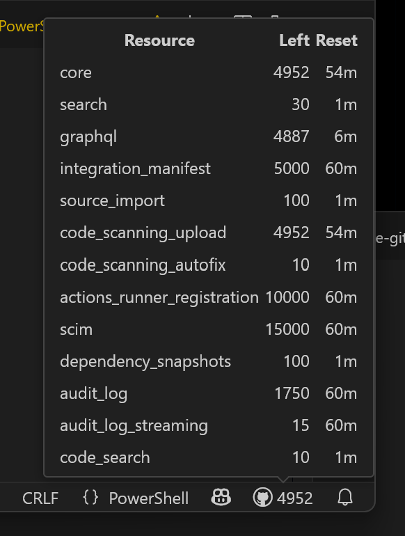

# GitHub Rate Limit Monitor

This Visual Studio Code extension monitors and displays your current GitHub API rate limit status in the status bar. 



It helps you avoid hitting GitHub's API rate limits by providing real-time feedback and alerts.

## Features
- Shows the number of remaining GitHub API requests in the status bar.
- Alerts you when the rate limit is exceeded and displays the reset time.
- Polls the GitHub API at a configurable interval (supports partial seconds, e.g., 0.5).
- Automatically updates the polling interval if you change the setting in VS Code.

## Configuration
You can configure the polling interval in seconds (including fractional values) via the setting:

```
"githubRateLimit.pollIntervalSeconds": 1
```

- Default: `1` (polls every 1 second)
- Example: Set to `0.5` for polling every half second

## Requirements
- You must be signed in to GitHub in VS Code for the extension to access your rate limit status.

## Usage
1. Install the extension.
2. Make sure you are signed in to GitHub in VS Code.
3. The status bar will show your current GitHub API rate limit. If you exceed the limit, you will see a warning and the reset time.
4. Adjust the polling interval in your settings if needed.

## License
MIT
